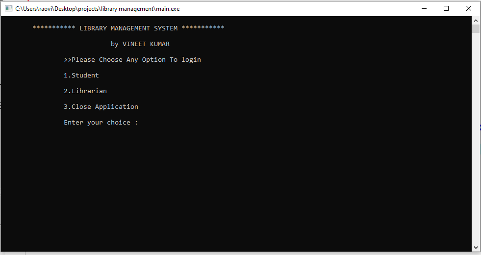

# Library-management-system
Library Management System is based on a concept of recording owned
books, issued books, returned books, students who have borrowed and many
more.
Talking about the features of the Library Management System, after
logging in as a student he/she can only view booklists. 
All the system is controlled by the librarian as he/she can view, search, modify, 
add, delete books, and Issue books. The other main feature contains re-issue
books and returns book. 

  
Features:

    Login System
    Login options
    Books branch
    Add, modify, view and delete books
    Issue book
    Re-issue book
    Return book
    Change password
    Fine charging system
